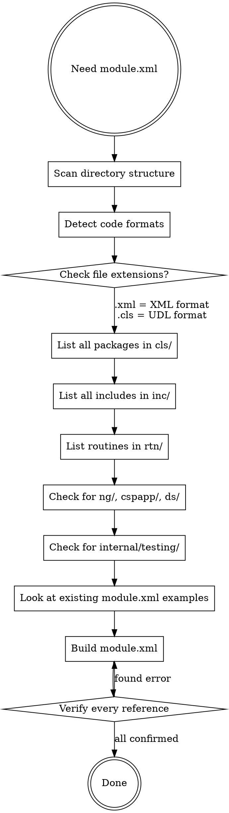

# Writing IPM Module Definitions (module.xml)

## Overview

IPM (InterSystems Package Manager) module.xml files define how an IRIS application is packaged, installed, and configured. This skill ensures you produce correct module.xml files by **verifying every detail against the actual codebase** rather than guessing.

**Core principle:** Never invent — always verify. Every Resource, Invoke, and WebApplication must reference something that actually exists on disk or in the code.

## When to Use

- Application in ISCX repo needs a new module.xml
- Existing module.xml needs updating after code changes
- Adding new resources, web apps, or setup automation to a module

## Process



## The Iron Rule: Never Guess

| What to verify | How to verify |
|---|---|
| Code format (XML vs UDL) | Check file extensions: `.xml` = XML, `.cls` = UDL |
| Package names | `ls cls/` — use actual directory names |
| Include files | `ls inc/` recursively — check subdirectories |
| Routine names | `ls rtn/` — use actual filenames |
| Class names in Invoke/DispatchClass | `grep -r "Class.*ClassName"` or read the actual file |
| Method names in Invoke | Read the class file and confirm the method exists |
| Web app URLs and paths | Check existing config or CSP app definitions in code |
| Unit test packages | `ls internal/testing/unit_tests/UnitTest/` |
| DeepSee resources | `ls ds/` — list each file individually, no wildcards |

**Red flags — STOP if you catch yourself:**
- Assuming a class or method exists without reading it
- Using wildcard patterns in Resource Name (IPM doesn't support `*.xml`)
- Copying Invoke blocks from another app without verifying the classes exist in THIS app
- Guessing authentication settings or role names

## Module.xml Structure

**Use the modern flat style** — `<Resource>` elements directly under `<Module>`. Do NOT use the older `<Resources>` wrapper or `<Attribute>` child element syntax (seen in ISISOnline/TestAssignment). The older style works but is verbose and inconsistent with most apps in this repo.

```xml
<?xml version="1.0" encoding="UTF-8"?>
<Export generator="Cache" version="25">
  <Document name="modulename.ZPM">
    <Module>
      <Name>modulename</Name>
      <Version>1.0.0+snapshot</Version>
      <Description>Brief description of the application</Description>
      <Packaging>module</Packaging>
      <SourcesRoot>.</SourcesRoot>

      <!-- Optional elements in typical order: -->
      <!-- SystemRequirements, Defaults, Dependencies -->
      <!-- Resources (packages, classes, includes, routines) -->
      <!-- Web Applications (CSPApplication or WebApplication) -->
      <!-- Invoke (setup automation) -->
      <!-- UnitTest -->
    </Module>
  </Document>
</Export>
```

```xml
<!-- CORRECT: modern flat style (Plaza, FunctionTool, TimeMachine, etc.) -->
<Resource Directory="cls" Name="Eval.PKG" Format="XML" />

<!-- WRONG: older verbose style — do not use -->
<Resources>
  <Resource Name="Eval.PKG">
    <Attribute Name="Directory">cls</Attribute>
    <Attribute Name="Format">XML</Attribute>
  </Resource>
</Resources>
```

## Resource Naming Conventions

Resources are identified by suffix that indicates the type:

| Suffix | Type | Example |
|---|---|---|
| `.PKG` | Package (all classes in a package) | `Eval.PKG` |
| `.CLS` | Single class | `Eval.Installer.CLS` |
| `.INC` | Include file | `appsOpenAPI.INC` |
| `.MAC` | Macro/routine | `%buildccr.MAC` |
| `.GBL` | Global | |
| `.DFI` | DeepSee item (pivot/dashboard) | `DistributionsByDay.DFI` |
| `.LUT` | Lookup table | |
| `.ESD` | Default settings | `Ens.Config.DefaultSettings.ESD` |

### Key Resource Attributes

| Attribute | Purpose | When to use |
|---|---|---|
| `Directory` | Source directory on disk | When files are in `cls/`, `inc/`, `rtn/`, etc. |
| `Format` | `"XML"` or `"UDL"` | Set `Format="XML"` if files have `.xml` extension. UDL is default. |
| `FilenameExtension` | Override file extension | Rarely needed; use when extension differs from default |
| `Preload` | Load before other resources | For installer classes needed during module load |
| `CompileAfter` | Compilation ordering | When one package depends on another |

### Format Detection

**Critical:** Check the actual file extensions in each directory.

- Files ending in `.xml` → `Format="XML"`
- Files ending in `.cls` → UDL format (omit Format attribute or use `Format="UDL"`)
- Files ending in `.inc` with no XML declaration → UDL format
- Files ending in `.inc` or `.mac` with `<?xml` header → `Format="XML"`

Different packages within the SAME app may use different formats. Check each one.

## Common Patterns in This Repo

### AppS Toolkit Clone (present in most apps)

Most apps include a copy of the AppS toolkit. Check `cls/` for `AppS/` and `zAppS/` directories, and `inc/` for the standard includes:

```xml
<!-- AppS Toolkit — verify these directories/files actually exist -->
<Resource Directory="cls" Name="AppS.PKG" Format="XML" />
<Resource Directory="cls" Name="zAppS.PKG" Format="XML" />
<Resource Directory="inc" Name="AppS.CodeTidy.ISTCodeTidy.INC" Format="XML" />
<Resource Directory="inc" Name="appsOpenAPI.INC" Format="XML" />
<Resource Directory="inc" Name="cosJSON.INC" Format="XML" />
<Resource Directory="inc" Name="jsonMap.INC" Format="XML" />
```

**Watch the casing:** The actual file is `jsonMap.INC` not `jsonMAP.INC`. Verify with `ls`.

### Web Applications

Two element types exist — use `WebApplication` for modern apps, `CSPApplication` for legacy.

**If you cannot verify web app config** (auth methods, roles, URLs), add an XML comment like `<!-- TODO: verify auth settings -->` rather than guessing values. Web app misconfiguration can break security.

```xml
<!-- Modern style (Plaza, IFD, TimeMachine) -->
<WebApplication
  Name="/${namespaceLower}"
  Path="${cspdir}${namespaceLower}"
  NameSpace="${namespace}"
  DispatchClass="AppName.Handler"
  AutheEnabled="#{$$$AutheDelegated}"
  Recurse="1"
  ServeFiles="1"
  ServeFilesTimeout="0"
  />

<!-- Legacy style (FunctionTool, RFEye) -->
<CSPApplication
  AuthenticationMethods="64"
  MatchRoles=":%All"
  CookiePath="/appname/"
  DefaultTimeout="900"
  Recurse="1"
  DispatchClass="AppName.API.Handler"
  Url="/appname/api"
  UseSessionCookie="2"/>
```

### IPM Variables (available in attribute values)

| Variable | Resolves to |
|---|---|
| `${namespace}` | Current namespace name |
| `${namespaceLower}` | Lowercase namespace |
| `${cspdir}` | CSP files directory |
| `${mgrdir}` | IRIS manager directory |
| `#{$$$AutheDelegated}` | Delegated auth macro |
| `#{$$$AutheUnauthenticated}` | Unauthenticated access macro |
| `#{$$$AuthePassword}` | Password auth macro |
| `#{..Root}` | Module root directory |
| `#{..Name}` | Module name |

### DeepSee Resources

Files on disk are named `Name.pivot.xml` or `Name.dashboard.xml`. In Resource Name, use the `.DFI` suffix:

```xml
<!-- File on disk: ds/DistributionsByDay.pivot.xml -->
<Resource Directory="ds" Name="DistributionsByDay.DFI" Format="XML" />

<!-- File on disk: ds/DistributionsByMonth.dashboard.xml -->
<Resource Directory="ds" Name="DistributionsByMonth.DFI" Format="XML" />
```

No existing module.xml in this repo includes DFI resources yet, so verify this convention works when first adopting it. An alternative is to use the full filename as the Name.

### Invoke Elements

```xml
<Invoke Class="ClassName" Method="MethodName" />
<Invoke Class="ClassName" Method="MethodName" Phase="Compile" When="After" />
<Invoke Class="ClassName" Method="MethodName" CustomPhase="Env" />
<Invoke Class="ClassName" Method="MethodName">
  <Arg>value</Arg>
</Invoke>
```

**Attributes:** `Class` (required), `Method` (required), `Phase`, `When` (Before/After), `CustomPhase`, `CheckStatus`

**Verification requirement:** Before adding ANY Invoke element, you MUST:
1. Read the actual class file to confirm the method exists
2. Check the method signature to get argument names/types right
3. If you cannot verify (e.g., class is too large to scan), add `<!-- TODO: verify Method exists -->` instead of guessing

### Unit Tests

```xml
<UnitTest Name="/internal/testing/unit_tests" Package="UnitTest.AppName" Format="UDL" />
```

Check `internal/testing/unit_tests/UnitTest/` for actual subdirectory names to determine packages. Format should match the test file format (XML or UDL).

### Dependencies

```xml
<Dependencies>
  <ModuleReference>
    <Name>isc.rest</Name>
    <Version>^1.2.1</Version>
  </ModuleReference>
</Dependencies>
```

Only add dependencies for IPM packages the app actually imports. Common ones: `isc.rest`, `isc.ipm.js`, `isc.changecontrol`, `isc.json`.

## Checklist Before Finalizing

- [ ] Every `Resource Name` corresponds to an actual directory or file on disk
- [ ] Format attribute matches actual file extensions (XML vs UDL) per package
- [ ] No wildcards in Resource Name
- [ ] Every `Invoke Class` and `Method` exists in the codebase
- [ ] Every `DispatchClass` in web apps exists in the codebase
- [ ] Include files checked recursively (subdirectories under `inc/`)
- [ ] Routine names use `.MAC` suffix (not `.rtn`) in the Resource Name
- [ ] AppS toolkit files verified present before including
- [ ] Unit test packages match actual directories under `internal/testing/unit_tests/UnitTest/`
- [ ] Module Name and Document name are consistent

## Common Mistakes

| Mistake | Fix |
|---|---|
| Using `jsonMAP.INC` instead of `jsonMap.INC` | Check actual filename casing with `ls` |
| Wildcards in Resource Name (`*.pivot.xml`) | List each resource individually |
| Routine resources with `.rtn` suffix | Use `.MAC` suffix in Resource Name |
| Guessing DispatchClass names | Read actual class files to find REST handler classes |
| Copying Invoke blocks from other apps | Verify every class and method exists in THIS app |
| Missing subdirectory includes | Recursively list `inc/` to find all include files |
| Wrong Format for a package | Check file extensions in EACH package directory separately |
| Assuming all packages use same format | XML and UDL can coexist in the same app |
| Using `<Resources>` wrapper + `<Attribute>` syntax | Use modern flat style: `<Resource Directory="cls" Name="X.PKG" Format="XML" />` |
| Inventing Invoke methods without reading class | Read the class file first; add `<!-- TODO: verify -->` if unsure |
| Guessing web app auth/roles without verification | Add `<!-- TODO: verify auth settings -->` comment |
